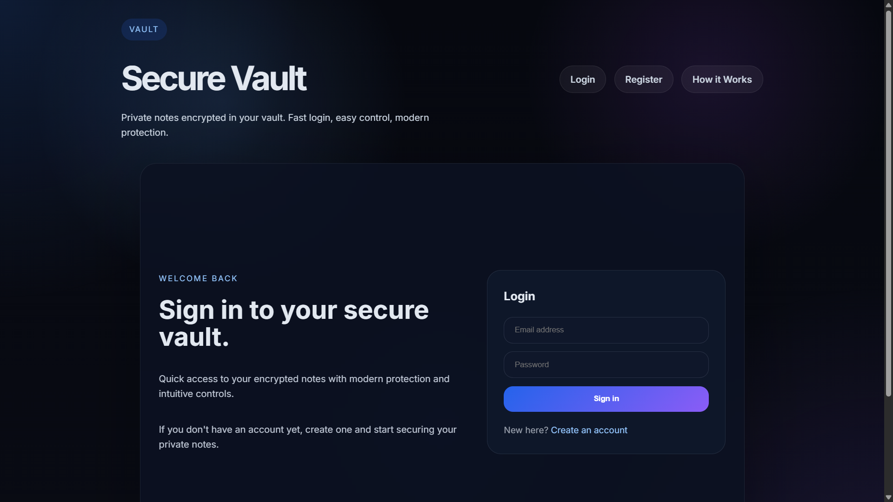
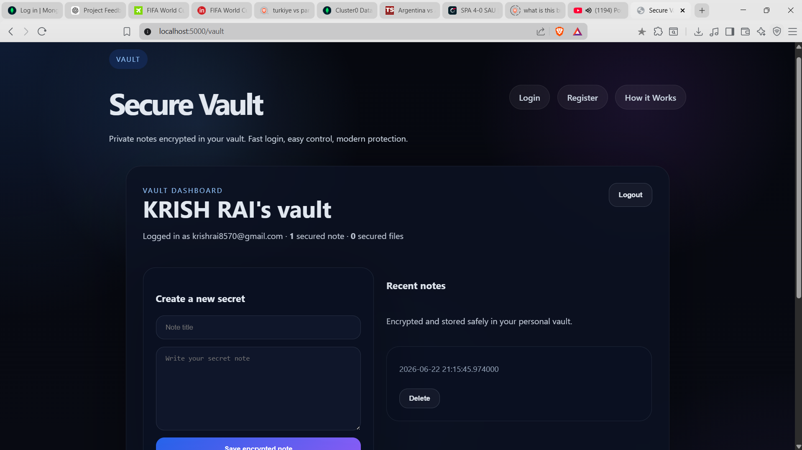
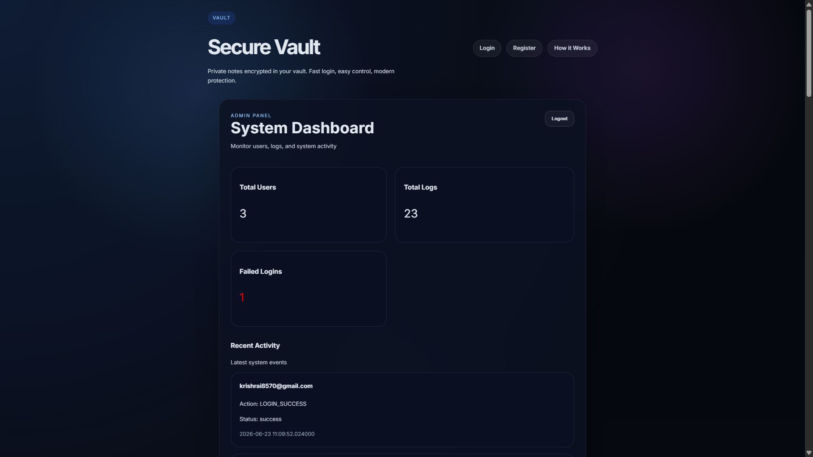
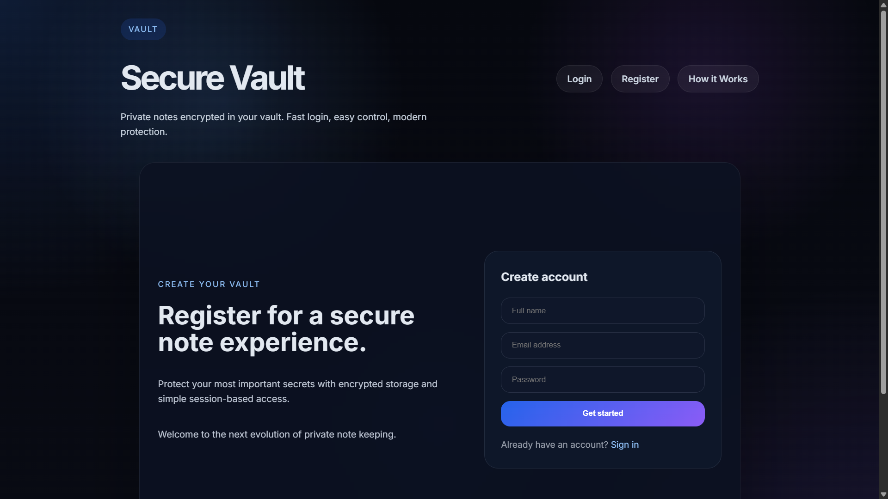
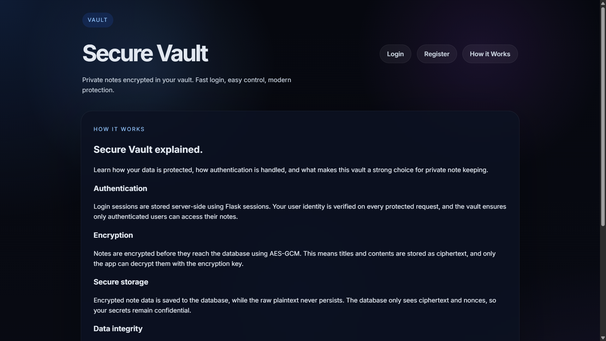

# 🔐 Secure Vault Web Application

## 📌 Overview

The **Secure Vault Web Application** is a Flask-based web application designed to securely store sensitive user data such as notes and files using encryption techniques. It ensures data confidentiality, implements role-based access control, and provides an admin dashboard for monitoring system activity.

---

## 🎯 Objective

To build a secure web application that implements authentication, authorization, and encrypted data storage while following secure coding practices and OWASP security principles.

---

## 🚀 Features

### 👤 User Features

* User Registration & Login
* Secure Password Hashing (bcrypt)
* Encrypted Notes Storage
* Encrypted File Upload & Storage
* View and Delete Notes/Files

### 👑 Admin Features

* Admin Dashboard
* View System Logs (Login Success/Failure)
* Monitor Suspicious Activity
* View System Statistics (Users, Logs, Failed Logins)

---

## 🛡️ Security Features

* Data Encryption for Notes & Files
* Input Sanitization (XSS Protection using Bleach)
* Password Hashing using Bcrypt
* CSRF Protection (Flask-WTF)
* Rate Limiting (Flask-Limiter)
* Protection against Injection Attacks
* Secure Session Handling

---

## 🧠 Technologies Used

* **Backend:** Python (Flask)
* **Database:** MongoDB
* **Security:** Bcrypt, JWT, Flask-WTF, Flask-Limiter, Bleach
* **Frontend:** HTML, CSS

---

## 📸 Screenshots

> Add screenshots here

### Home Page


### Vault Dashboard


### Admin Dashboard


### Register Page


### How it Works

---

## ⚙️ Installation & Setup

### 1. Clone the repository

```bash
git clone https://github.com/KrishRai17/CodecProject.git
cd CodecProject
```

### 2. Create virtual environment

```bash
python -m venv .venv
.venv\Scripts\activate   # Windows
```

### 3. Install dependencies

```bash
pip install -r requirements.txt
```

### 4. Set environment variables

Create a `.env` file:

```
SECRET_KEY=your_secret_key
JWT_SECRET=your_jwt_secret
ENCRYPTION_KEY=your_encryption_key
```

### 5. Run the application

```bash
python app.py
```

---

## 🌐 Usage

* Open browser: `http://localhost:5000`
* Register/Login
* Store encrypted notes and files
* Admin users can access `/admin-dashboard`

---

## 📊 Project Highlights

* Implements real-world web security practices
* Covers OWASP Top 10 vulnerabilities
* Uses encryption for secure data storage
* Includes role-based admin monitoring system

---

## 🔗 Links

* GitHub Repository: https://github.com/KrishRai17/CodecProject
* LinkedIn Post: [Add your LinkedIn post link]

---

## 👨‍💻 Author

**Krish Rai**

---

## 📄 License

This project is for educational purposes only.
